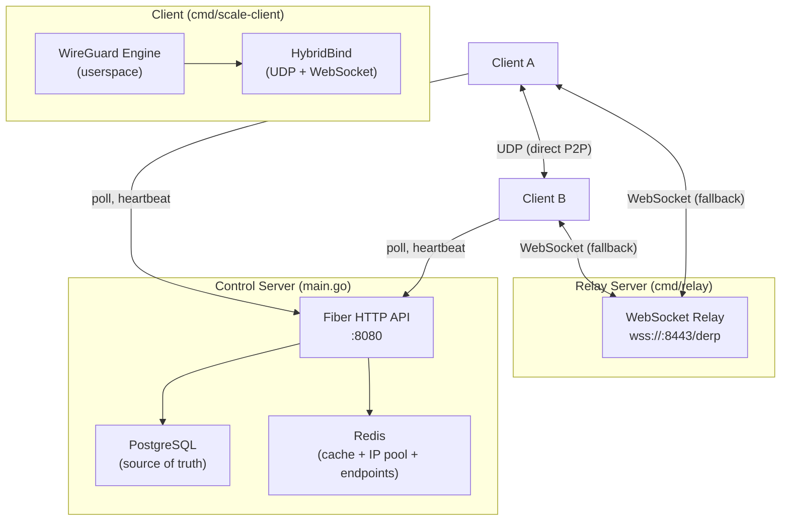
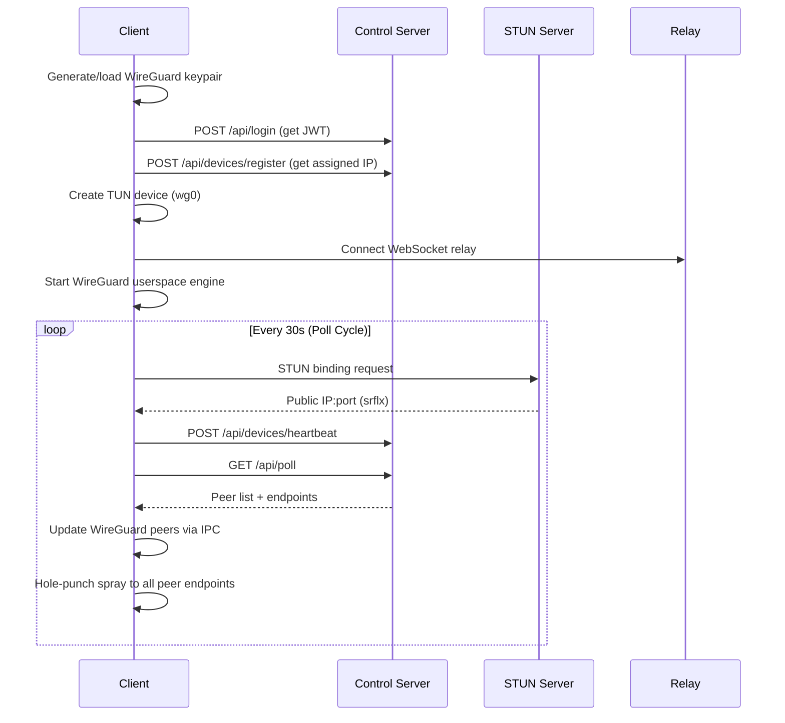

# Scale — Project Overview

**Scale** is a **Tailscale-alternative VPN** built from scratch in Go. It creates a WireGuard-based mesh network where devices connect via a central control server, discover each other's endpoints, and establish encrypted peer-to-peer tunnels — with automatic relay fallback when direct UDP fails.

---

## Architecture (3 Binaries)

---

## 1. Control Server (`main.go`)

The central coordination plane. It does NOT forward traffic — it only manages identity, IPs, and peer discovery.

### Tech Stack
| Component | Technology |
|-----------|-----------|
| HTTP Framework | [Fiber](https://gofiber.io/) (Go) |
| Primary DB | PostgreSQL via GORM |
| Cache / State | Redis |
| Auth | JWT (HS256) + bcrypt passwords |

### API Endpoints

| Method | Route | Auth | Purpose |
|--------|-------|------|---------|
| `POST` | `/api/register` | None | User registration (email + password) |
| `POST` | `/api/login` | None | Returns JWT token |
| `GET` | `/api/user` | JWT | Get current user info |
| `POST` | `/api/logout` | JWT | Clear JWT cookie |
| `POST` | `/api/devices/register` | JWT | Register a device (public key → assigned IP) |
| `POST` | `/api/devices/heartbeat` | JWT | Report device endpoints (host + STUN-discovered) |
| `GET` | `/api/devices/:id/peers` | JWT | Get peer config for a specific device |
| `GET` | **`/api/poll`** | JWT | **Primary client endpoint** — returns STUN token + full peer list with endpoints |
| `GET` | `/api/stun` | Token | Lightweight NAT type detection |

### Data Flow

1. **Device Registration**: Client sends WireGuard public key → server allocates IP from `100.64.0.0/24` pool (stored in Redis as a set) → persists device in PostgreSQL
2. **Heartbeat**: Client periodically reports its endpoints (local IPs + STUN-derived public IP:port) → stored in Redis with 90s TTL (`device:endpoints:<pubkey>`)
3. **Poll**: Client fetches all peers + their cached endpoints → builds WireGuard peer config locally
4. **Device Cache**: All devices from PostgreSQL are cached in Redis (`cache:all_devices`) and refreshed every 10s in a background goroutine

---

## 2. Client (`cmd/scale-client/`)

A userspace WireGuard client with smart networking.

### Startup Flow

### Key Features

- **HybridBind** ([hybrid.go](file:///home/sankalp/Documents/scale/internal/vpn/hybrid.go)): Custom `conn.Bind` implementation for WireGuard that handles **both** UDP (direct P2P) and WebSocket (relay) simultaneously
- **STUN Discovery**: Uses `stun.l.google.com:19302` to discover public-facing IP:port
- **Endpoint Selection Priority**: LAN IPs → STUN (srflx) → first available
- **Hole Punching**: Sends 5-round probe spray to all peer candidate endpoints
- **Keepalives**: Custom probe packets (magic `0xFF505242` + pubkey) every 5s per peer to maintain NAT mappings and detect liveness
- **Health Monitor**: Monitors UDP send failures; if threshold (5) hit, automatically switches all peers to relay endpoints
- **Auto-recovery**: When UDP recovers, switches back to direct connections
- **Peer Roaming**: Detects when a peer's address changes via probe responses and dynamically updates WireGuard endpoint

### Custom Protocols

| Protocol | Magic | Size | Purpose |
|----------|-------|------|---------|
| WireGuard | `0x01`–`0x04` (first byte) | Variable | Normal WG handshake/data |
| STUN | `0x2112A442` (bytes 4-8) | Variable | NAT discovery |
| Probe/Keepalive | `0xFF505242` (bytes 0-4) | 36 bytes | Liveness + roaming detection |

---

## 3. Relay Server (`cmd/relay/`)

A **DERP-like** WebSocket relay for when direct UDP fails (symmetric NAT, firewalls, etc).

- Listens on `wss://:8443/derp` with TLS
- Auth via `DERP_AUTH_KEY` query param
- Clients register by sending their 32-byte public key
- Packets are routed: `[dest_key(32B) | payload]` → server looks up dest in `clients` map → forwards as `[sender_key(32B) | payload]`
- Ping/pong keepalives (60s timeout)
- Thread-safe with `sync.Once` cleanup

---

## 4. IP Allocation (`ipmanager/`)

- Manages a `/24` pool (`100.64.0.0/24` — CGNAT range, 254 usable IPs)
- Pool stored as a Redis set (`ip_pool:available`)
- Allocation = `SPOP` (atomic pop from set)
- Release = `SADD` back to set
- **Limitation**: Pool is initialized from hardcoded CIDR, not persisted across Redis restarts

---

## 5. Database Schema

### PostgreSQL (via GORM auto-migrate)

| Table | Fields |
|-------|--------|
| `users` | id, name, email (unique), password_hash, created_at, updated_at, deleted_at |
| `devices` | id, public_key (unique), assigned_ip (unique), endpoint, user_id, created_at, updated_at, deleted_at |

### Redis Keys

| Key Pattern | Type | TTL | Purpose |
|-------------|------|-----|---------|
| `cache:all_devices` | String (JSON) | None | Cached device list from PostgreSQL |
| `device:endpoints:<pubkey>` | String (JSON) | 90s | Live endpoint list per device |
| `ip_pool:available` | Set | None | Available IPs for allocation |

---

## 6. Known Limitations

> [!WARNING]
> This is a **learning/PoC project**, not production-ready.

- IP pool is a hardcoded `/24` — max 254 devices
- No persistence of IP pool across Redis restarts (new IPs may conflict with PostgreSQL records)
- Configs are unsigned — clients trust the server blindly (MITM risk)
- Keys are regenerated on every client restart (`generateOrLoadKeys` creates a new key each time)
- `InsecureSkipVerify: true` on relay WebSocket TLS
- No multi-user isolation — all devices see all other devices regardless of user
- Single relay server, no relay selection or geo-routing
- `GetPeerConfig` endpoint (`/api/devices/:id/peers`) still has the same Redis-only bug (no PostgreSQL fallback) that we just fixed in `/api/poll`
